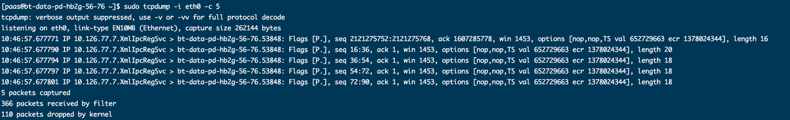
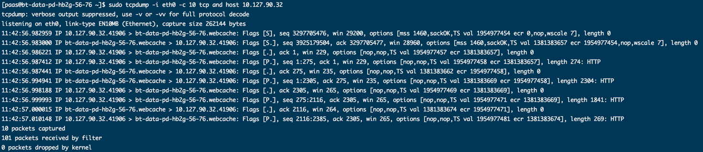

---

title: "Linux 系统参数及命令使用说明"
layout: post
category: daily-note
tags: [linux, system]
excerpt: "平时工作中，总会遇到一些linux的参数或者命令。工作工程中遇到的命令记录
在此处，下次再用到时查阅这里就行了，不用每次都花费时间去google."
------------------------------------

# 系统参数

## open files 相关

### 查看 & 修改

通过 ulimit 可以查看当前的限制是多少:

```
$ ulimit -n
$ ulimit -Sn
$ ulimit -Hn
```

ulimit 中，每个限制都有两种类型：

- -S, soft limit, 软限制，用户可以上调软限制到硬限制
- -H, hard limit, 硬限制，非 root 用户不能修改

临时修改使用 ulimit 命令，以修改 open file(s) 为例。

```
$ ulimit -n 1024000
$ ulimit -n
```

永久修改需要修改 /etc/security/limits.conf 或者在 /etc/security/limits.d/
目录下添加一个文件。 具体格式参考 /etc/security/limits.conf，里面有详细说明。

### 设置上限

open file(s) kernel 级别有 2 个配置，分别是：

```
fs.nr_open，进程级别
fs.file-max，系统级别
```

s.nr_open 默认设置的上限是 1048576，所以用户的 open file(s) 不可能超过这个上限。

```
# sysctl -w fs.nr_open=10000000
# ulimit -n 10000000
# ulimit -n
10000000
```

修改后即可设置更大的 open file(s) 了。

同样，对于 kernel 参数的修改，sysctl 命令修改的是当前运行时，如果需要永久修改，
则将配置添加到 /etc/sysctl.conf 中，例如：

```
# echo "fs.nr_open = 10000000" >> /etc/sysctl.conf
# echo "fs.file-max = 11000000" >> /etc/sysctl.conf
```

注意：fs.nr_open 总是应该小于等于 fs.file-max。

如果要查看当前打开的文件数，使用下面的命令：

```
# sysctl fs.file-nr
fs.file-nr = 1760       0       11000000
```

不过，增大这些值意味着能够打开更多的文件（在 Linux 中，everything is file，包括
socket），但是同时也意味着 消耗更多的资源，所以基本上在物理机上才会遇到这种问题。

# 常用命令

## tcpdump

转储符合 expression 条件的网络流量。

### 命令格式

```
tcpdump [ -AbdDefhHIJKlLnNOpqStuUvxX# ] [ -B buffer_size ]
        [ -c count ]
        [ -C file_size ] [ -G rotate_seconds ] [ -F file ]
        [ -i interface ] [ -j tstamp_type ] [ -m module ] [ -M secret ]
        [ --number ] [ -Q|-P in|out|inout ]
        [ -r file ] [ -V file ] [ -s snaplen ] [ -T type ] [ -w file ]
        [ -W filecount ]
        [ -E spi@ipaddr algo:secret,...  ]
        [ -y datalinktype ] [ -z postrotate-command ] [ -Z user ]
        [ --time-stamp-precision=tstamp_precision ]
        [ --immediate-mode ] [ --version ]
        [ expression ]
```

### 主要参数说明

- -i interface

  监视指定网络接口的数据包。

- -c count

  获取 count 个包之后退出。

  

- -C file_size

  在写文件之前，检查文件的大小是否大于 file_size，如果大于，关闭当前文件，打开一个新
  文件。保存的第一个文件名由 -w 指定，然后增加一个数据，由 1 开始自增。file_size 的
  单位为 1 百万字节（1,000,000 字节, 不是 1,048,576 字节）。

- -w file

  把包数据直接写入文件而不进行分析和打印输出. 这些包数据可在随后通过-r 选项来重新读入  
  并进行分析和打印。

- -W filecount

  可打印的文件数目，与 -C 参数配合使用。

- -r file

  从文件file 中读取包数据. 如果file 字段为 '-' 符号, 则tcpdump 会从标准输入中读取  
  包数据.

### expression 条件表达式

该表达式用于决定哪些数据包将被打印. 如果不给定条件表达式, 网络上所有被捕获的包都会被打  
印,否则, 只有满足条件表达式的数据包被打印。

有三种不同类型的修饰符(或者说限定符):type, dir以及 proto

- type：指定id 所代表的对象类型, id可以是名字也可以是数字。可选的对象类型有：
  - host 表明id表示主机，如 host 10.126.45.54
  - net 表明id是网络，如 net 128.3
  - port 表明id是端口，如 port 20
  - portrange 表明id是一个端口范围，如 portrange 6000-6008
- dir：描述id 所对应的传输方向, 即发往id 还是从id 接收。如果不指定dir修饰符, id 默认的修饰符为src or dst.可取的方向为：
  - src: 表示id是传输源
  - dst: 表示id是传输目的
  - src or dst: 表示id是传输源或者传输目的
  - src and dst: 表示id是传输源并且是传输目的
- proto：描述id所属的协议。常用的协议有: ether, wlan, ip, ip6, arp, rarp, tcp以及 upd。

### 输出解释

#### TCP 包的输出信息
用tcpdump捕获的TCP包的一般输出信息是：



除了前面的时间和协议外，其余的项符合下面的一般格式：
```
src > dst: flags data-seqno ack window urgent options
```
src > dst:表明从源地址到目的地址， flags是TCP报文中的标志信息，具体描述如下:

| 标识 | 字符缩写 | 描述 |
|---|---|---|
| S | SYN | 同步标识
| F | FIN | 终止标识
| R | RST | 复位标识
| P | PSH | 推送标识

data-seqno是报文中的数据的顺序号， ack是下次期望的顺序号， window是接收缓存的窗口大小， urgent表明 报文中是否有紧急指针。 Options是选项。

## WireShark