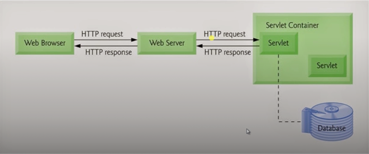
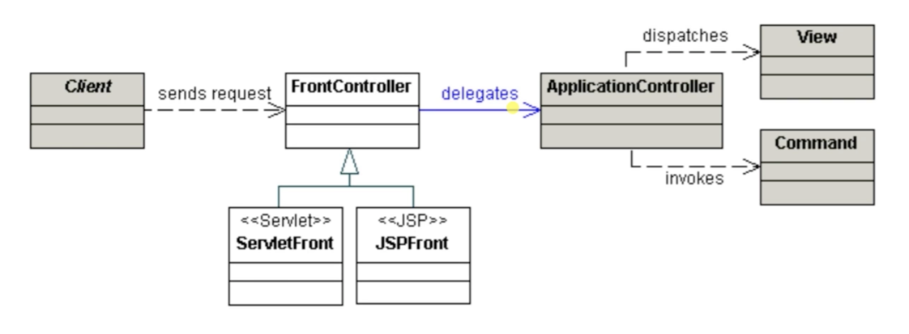
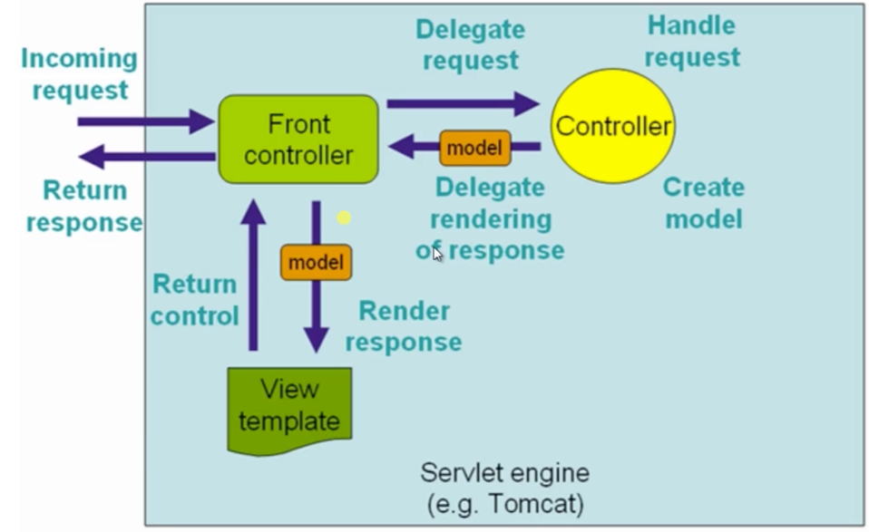
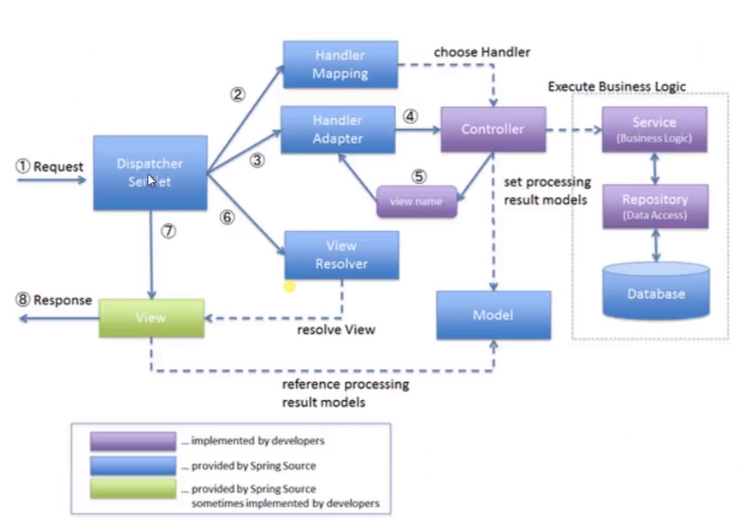

# 概览

## Spring Boot 特性

- **组件自动装配：** 规约大于配置，专注于核心业务
- **嵌入式容器：** 内置容器、无需部署、独立运行
- **Production-Ready：** 一站式运维， [生态](https://spring.io/blog/2018/03/16/micrometer-spring-boot-2-s-new-application-metrics-collector)无缝整合
- 外部化配置：一次构建、按需调配，到处运行
- Spring Boot Starter：简化依赖、按需装配、自我包含

### 易学难精

- **组件自动装配：** 模式注解、@Enable 模块、条件装配、加载机制
- **外部化配置：** Environment 抽象、生命周期、破坏性变更
- **嵌入式容器：** Servlet Web 容器、Reactive Web 容器
- **Spring Boot Starter：** 依赖管理、装配条件、装配顺序
- **Production-Ready：** 健康检查、数据指标、@Endpoint 管控

### 核心特性

#### 组件自动装配

- 激活：@EnableAutoConfiguration
- 配置：/META-INF/spring.factories
- 实现：XXXAutoConfiguration

#### 嵌入式 Web 容器

- Web Servlet: Tomcat、Jetty 和 Undertow
- Web Reactive: Netty Web Server

##### 传统 Servlet 应用

- Servlet 组件：Servlet、Filter、Listener
  - Servlet
    - 实现
      - @WebServlet
      - extends HttpServlet
      - 注册
    - URL 映射
      - @WebServlet(urlPatterns="/my/servlet")
    - 注册
      - @ServletComponentScan(basePackages = "com.imooc.diveinspringboot.web.servlet")
- Servlet 注册：Servlet 注解（Servlet 3.0）、Spring Bean、RegistrationBean
- 异步非阻塞（Servlet 3.0+）：异步 Servlet（3.0）、非阻塞 Servlet（3.1）

##### Spring Web MVC 应用

- Web MVC 视图：模板引擎、内容协商、异常处理等
  - 视图
    - ViewResolver
    - View
  - 模板引擎
    - Thymeleaf
    - FreeMarker
    - JSP
  - 内容协商
    - ContentNegotiationConfigurer
    - ContentNegotiationStrategy
    - ContentNegotiationResolver
  - 异常处理
    - @ExceptionHandler
    - HandleExceptionResolver
      - ExceptionHandleExceptionResolver
    - BasicErrorController
- Web MVC Rest：资源服务、资源跨域、服务发现等
  - 资源服务
    - `@RequestMapping`
      - `@GetMapping`
    - `@ResponseBody`
    - `@RequestBody`
  - 资源跨域
    - `CrossOrigin`
    - `WebMvcConfigurer#addCorsMappings`
    - 传统解决方案
      - IFrame
      - JSONP
  - 服务发现
    - HATEOS
- Web MVC 核心：核心架构、处理流程、核心组件
  - 核心组件
    - `DispatcherServlet`
    - `HandlerMapping`
    - `HandlerAdapter`
    - `ViewResolver`
    - ...

##### Spring Web Flux 应用

- Reactor 基础：Java Lambda、Mono、Flux
- Web Flux 核心：Web MVC 注解、函数式声明、异步非阻塞
- 使用场景：Web Flux 优势和限制

##### Web Server 应用

- 切换 Web Server
- 自定义 Servlet Web Server
- 自定义 Reactive Web Server

#### Production-Ready

- 指标：/actuator/metrics
- 健康检查：/actuator/health
- 外部化配置：/actuator/configprops

## Spring Boot 与 Java EE 规范

- Web : Servlet
- SQL : JDBC
- 数据校验 : Bean Validation
- 缓存 : Java Caching API
- WebSockets : Java API for WebSocket
- Web Services : JAX-WS
- Java 管理 : JMX
- 消息 : JMS

## 数据介绍

- JDBC：数据源、JdbcTemplate、自动装配
- JPA：实体映射关系、实体操作、自动装配
- 事务：Spring 事务抽象、JDBC 事务处理、自动装配

## Spring Boot 应用

- SpringApplication: 失败分析、应用特性、事件监听等
- Spring Boot 配置: 外部化配置、Profile、配置属性
- Spring Boot Starter: Starter 开发、最佳实践

# 走向自动装配

## Spring Framework 手动装配

### Spring 模式注解装配

**定义**: 一种声明在应用中扮演"组件"角色的注解。

**举例**：@Component、@Service、@Configuration等。

**装配**：<context:component-scan> 或者 @ComponentScan。

### Spring @Enable 模块装配

**定义**：具备相同领域功能的组件集合，组合所形成一个独立的单元。

**举例**：@EnableWebMvc、@EnableAutoConfiguration 等。

**实现**：注解方式、编程方式。

### Spring 条件装配

**定义**：Bean 装配的前置条件。

**举例**：@Profile、@Conditional。

**实现**：注解方式、编程方式。

- 注解方式：@Profile
- 编程方式：

    1 实现 Condition 接口
    ```java
  /**
   * 系统属性条件判断
   *
   * @author guangp
   * @since 2020/6/30
   */
  public class OnSystemPropertyCondition implements Condition {
      /**
       * 判断
       * @param context 条件上下文
       * @param metadata 注解、方法的元数据信息
       * @return
       */
      @Override
      public boolean matches(ConditionContext context, AnnotatedTypeMetadata metadata) {
          Map<String, Object> attributes =
                  metadata.getAnnotationAttributes(ConditionalOnSystemProperty.class.getName());
          String propertyName = (String) attributes.get("name");
          String propertyValue = (String) attributes.get("value");
          String systemPropertyValue = System.getProperty(propertyName);
          return propertyValue.equals(systemPropertyValue);
      }
  }
    ```
  2 创建条件注解
  ```java
  /**
   * Java 系统属性 条件判断
   *
   * @author guangp
   * @since 2020/6/30
   */
  @Target({ElementType.TYPE, ElementType.METHOD})
  @Retention(RetentionPolicy.RUNTIME)
  @Documented
  @Conditional(OnSystemPropertyCondition.class)
  public @interface ConditionalOnSystemProperty {
      /**
       * Java 系统属性名称
       * @return
       */
      String name();
  
      /**
       * Java 系统属性值
       * @return
       */
      String value();
  }
  ```
  3 应用注解
  ```
  @Bean
  @ConditionalOnSystemProperty(name = "user.name", value = "guangp")
  public String helloWorld() {  
      return "Hello, World. 2020";
  }
  ```

## Spring Boot 自动装配

**定义**：基于约定大于配置的原则，实现 Spring 组件自动装配的目的

**装配**：模式注解、@Enable 模块、条件装配、工厂加载机制

**实现**：激活自动装配、实现自动装配、配置自动装配实现

1 激活自动装配
```java
@EnableAutoConfiguration
public class EnableAutoConfigurationBootstrap {
    public static void main(String[] args) {
        ConfigurableApplicationContext context = new SpringApplicationBuilder(EnableAutoConfigurationBootstrap.class)
                .web(WebApplicationType.NONE)
                .run(args);

        String helloWorld = context.getBean("helloWorld", String.class);
        System.out.println(helloWorld);

        // 关闭上下文
        context.close();
    }
}
```
2 实现自动装配
```java
/**
 * HelloWorld 自动装配
 *
 * @author guangp
 * @since 2020/6/29
 */
@Configuration // Spring 模式注解装配
@EnableHelloWorld // Spring @Enable 模块装配
@ConditionalOnSystemProperty(name = "user.name", value = "guangp") // 条件装配
public class HelloWorldAutoConfiguration {
}
```
3 配置自动装配实现
```
# META-INF/spring.factories
# 自动装配
org.springframework.boot.autoconfigure.EnableAutoConfiguration=\
com.imooc.diveinspringboot.configuration.HelloWorldAutoConfiguration
```

# 理解 SpringApplication

## 基础技术
### Spring Framework
- Spring 模式注解
- Spring 应用上下文
- Spring 工厂加载机制
- Spring 应用上下文初始化器
- Spring Environment 抽象
- Spring 应用事件/监听器

## 衍生技术
### Spring Boot
- SpringApplication
- SpringApplication Builder API
- SpringApplication 运行监听器
- SpringApplication 参数
- SpringApplication 故障分析
- Spring Boot 应用事件/监听器

## 准备阶段

### SpringApplication

定义：Spring 应用引导类，提供便利的自定义行为方法

场景：嵌入式 Web 应用和非 Web 应用

运行：SpringApplication#run(String...)

#### 基本使用

```
SpringApplication.run(DiveInSpringBootApplication.class, args);
```
#### 自定义 SpringApllication

- SpringApplication API
- SpringApplicationBuilder API

### 过程

#### 配置：Spring Bean 来源

```
/**
 * SpringApplication 引导类
 *
 * @author guangp
 * @since 2020/7/7
 */
public class SpringApplicationBootstrap {
    public static void main(String[] args) {
//        SpringApplication.run(ApplicationConfig.class, args);
        Set<String> sources = new HashSet<>();
        sources.add(ApplicationConfig.class.getName());
        
        SpringApplication springApplication = new SpringApplication();
        // 配置源
        springApplication.setSources(sources);
        springApplication.setWebApplicationType(WebApplicationType.NONE);
        ConfigurableApplicationContext context = springApplication.run(args);
        System.out.println("Bean: " +  context.getBean(ApplicationConfig.class));
    }

    @SpringBootApplication
    public static class ApplicationConfig {
    }
}
```

#### 推断：Web 应用类型和主引导类

```
public SpringApplication(ResourceLoader resourceLoader, Class<?>... primarySources) {
	this.resourceLoader = resourceLoader;
	Assert.notNull(primarySources, "PrimarySources must not be null");
	this.primarySources = new LinkedHashSet<>(Arrays.asList(primarySources));
	this.webApplicationType = WebApplicationType.deduceFromClasspath();
	setInitializers((Collection) getSpringFactoriesInstances(ApplicationContextInitializer.class));
	setListeners((Collection) getSpringFactoriesInstances(ApplicationListener.class));
	this.mainApplicationClass = deduceMainApplicationClass();
}
```
推断 Web 应用类型
```
static WebApplicationType deduceFromClasspath() {
	if (ClassUtils.isPresent(WEBFLUX_INDICATOR_CLASS, null) && !ClassUtils.isPresent(WEBMVC_INDICATOR_CLASS, null)
			&& !ClassUtils.isPresent(JERSEY_INDICATOR_CLASS, null)) {
		return WebApplicationType.REACTIVE;
	}
	for (String className : SERVLET_INDICATOR_CLASSES) {
		if (!ClassUtils.isPresent(className, null)) {
			return WebApplicationType.NONE;
		}
	}
	return WebApplicationType.SERVLET;
}
```
推断主引导类
```
private Class<?> deduceMainApplicationClass() {
	try {
		StackTraceElement[] stackTrace = new RuntimeException().getStackTrace();
		for (StackTraceElement stackTraceElement : stackTrace) {
			if ("main".equals(stackTraceElement.getMethodName())) {
				return Class.forName(stackTraceElement.getClassName());
			}
		}
	}
	catch (ClassNotFoundException ex) {
		// Swallow and continue
	}
	return null;
}
```
#### 加载：应用上下文初始器和应用事件监听器

## 运行阶段

### 加载：SpringApplication 运行监听器（SpringApplicationRunListeners）
利用 Spring 工程加载机制，读取 SpringApplicationRunListener 对象集合，并封装到组合类。
```
public ConfigurableApplicationContext run(String... args) {
	StopWatch stopWatch = new StopWatch();
	stopWatch.start();
	ConfigurableApplicationContext context = null;
	Collection<SpringBootExceptionReporter> exceptionReporters = new ArrayList<>();
	configureHeadlessProperty();
	// 调用 getRunListeners 加载 SpringApplication 运行监听器（SpringApplicationRunListeners）
	SpringApplicationRunListeners listeners = getRunListeners(args);
	listeners.starting();
	...
}

private SpringApplicationRunListeners getRunListeners(String[] args) {
	Class<?>[] types = new Class<?>[] { SpringApplication.class, String[].class };
	return new SpringApplicationRunListeners(logger,
			getSpringFactoriesInstances(SpringApplicationRunListener.class, types, this, args));
}
```
### 运行：SpringApplication 运行监听器（SpringApplicationRunListeners）
SpringApplicationRunListener 监听多个运行态方法：

| 监听方法 | 阶段说明 | Spring Boot 起始版本 |
|---|---|---|
| starting() | Spring 应用刚启动 | 1.0 |
| environmentPrepared(ConfigurableEnvironment environment) | environment 准备完成，但是在 ApplicationContext 创建之前 | 1.0 |
| contextPrepared(ConfigurableApplicationContext context) | ApplicationContext 创建完成，但是在 sources 加载之前 | 1.0 |
| contextLoaded(ConfigurableApplicationContext context) | ApplicationContext 加载完成，但是在 refresh 之前 | 1.0 |
| started(ConfigurableApplicationContext context) | ApplicationContext refresh 完成，应用也已启动，但是在 CommandLineRunners 和 ApplicationRunner 被调用之前 | 2.0.0 |
| running(ConfigurableApplicationContext context) | run() 结束前立即被调用，此时 context refresh 完成，CommandLineRunners 和 ApplicationRunner 也已被调用 | 2.0.0 |
| failed(ConfigurableApplicationContext context, Throwable exception) | Spring 应用运行失败 | 2.0.0 |

### 监听 Spring Boot / Spring 事件

Spring Boot 通过 SpringApplicationRunListener 的实现类 EventPublishingRunListener，利用
Spring Framework 事件 API，广播 Spring Boot 事件。

#### Spring Framework 事件/监听器编程模型

- Spring 应用事件
  - 普通应用事件：`ApplicationEvent`
  - 应用上下文事件：`ApplicationContextEvent`
- Spring 应用监听器
  - 接口编程模型：ApplicationListener
  - 注解编程模型：@EventListener
- Spring 应用事件广播
  - 接口：ApplicationEventMulticaster
  - 实现类：SimpleApplicationEventMulticaster
    - 执行模式：异步 或 同步

### 创建：应用上下文、Environment、其他（不重要）

### 失败：故障分析报告

### 回调：CommandLineRunner、ApplicationRunner

# Web MVC 核心

## 理解 Spring Web MVC 架构

### 基础架构：Servlet



#### Servlet 特点
- 请求/响应式(Request/Response)
- 屏蔽网络通讯的细节
- 完整的生命周期

#### Servlet 职责
- 处理请求
- 资源管理
- 视图渲染

### 核心架构： [前端控制器（Front Controller）](http://www.corej2eepatterns.com/FrontController.htm)



### Spring Web MVC 架构



## 认识 Spring Web MVC

- 实现 Controller
- 配置 Web MVC 组件
- 部署 DispatcherServlet

### Web MVC 核心组件

#### 处理器管理

- 映射：HandlerMapping

    映射请求(Request)与处理器(Handler)，加上关联的拦截器(HandlerInterceptor)列表。主要有两种实现：
    `RequestMappingHandlerMapping` 支持标注 `@RequestMapping` 的方法；
    `SimpleUrlHandlerMapping` 维护精确的 URI 路径与处理器的映射。

- 适配：HandlerAdapter

    帮助`DispatcherServlet`调用请求处理器(Handler)。
    
- 执行：HandlerExceptionChain

#### 页面渲染

- 视图解析：ViewResolver

    从处理器(Handlers)返回的字符类型的逻辑视图名称解析出实际的 View 对象，将该对象渲染
    后的内容输出到 HTTP 响应中。
    
- 国际化：LocaleResolver、LocalContextResolver

    从客户端解析出 Locale，为其实现国际化视图。
    
个性化：ThemeResolver

#### 异常处理

- 异常解析：HandlerExceptionResolver

    解析异常，可能的处理策略是将异常映射到其他处理器、或到某个html页面。

### 交互流程



### Web MVC 注解驱动 (3.1+)

- 注解配置：@Configuration（Spring 范式注解）
- 组件激活：@EnableWebMvc（Spring 模块装配）
- 自定义组件配置：WebMvcConfigurer（Spring Bean）
- 模型属性：@ModuleAttribute
- 请求头：@RequestHeader
- Cookie：@CookieValue

```
@Controller
public class HelloWorldController {
    @RequestMapping("")
    public String index(Model model) {
        return "index";
    }

    @ModelAttribute("message")
    public String message() {
        return "Hello World";
    }

    @ModelAttribute("acceptLanguage")
    public String acceptLanguage(@RequestHeader("acceptLanguage") String acceptLanguage) {
        return acceptLanguage;
    }

    @ModelAttribute("jSessionId")
    public String jSessionId(@RequestHeader("jSessionId") String jSessionId) {
        return jSessionId;
    }
}
```
- 校验参数：@Valid、@Validated
- 注解处理：@ExceptionHandler
- 切面通知：@ControllerAdvice
    用来定义一种特殊的 @Component，其中定义一些多个 @Controller 共享的 ExceptionHandler、InitBinder和ModelAttribute

### Web MVC 自动装配

- Servlet 依赖：Servlet 3.0+
- Servlet SPI：ServletContainerInitializer
- Spring 适配：SpringServletContainerInitializer
- Spring SPI：WebApplicationInitializer
```java
/**
 * {@link WebApplicationInitializer} 实现
 * 配置化方式替代 web.xml
 *
 * @Author: guangp
 * @Date: 2020-07-18
 */
public class MyWebAppInitializer implements WebApplicationInitializer {
    @Override
    public void onStartup(ServletContext servletContext) throws ServletException {
        // 加载 SpringApplicationContext
        XmlWebApplicationContext xmlContext = new XmlWebApplicationContext();
        xmlContext.setConfigLocation("/WEB-INF/app-context.xml");
        
        // 配置 DispatcherServlet
        ServletRegistration.Dynamic dispatcherServlet = servletContext.addServlet("dispatcherServlet", DispatcherServlet.class);
        dispatcherServlet.setLoadOnStartup(1);
        dispatcherServlet.addMapping("/");
        dispatcherServlet.setInitParameter("contextConfigLocation", "/WEB-INF/app-context.xml");
    }
}
```
- 编程驱动：AbstractDispatcherServletInitializer
- 注解驱动：AbstractAnnotationConfigDispatcherServletInitializer
```java
/**
 * {@link AbstractAnnotationConfigDispatcherServletInitializer} 默认实现
 *
 * @Author: guangp
 * @Date: 2020-07-18
 */
public class DefaultAnnotationConfigDispatcherServletInitializer extends
        AbstractAnnotationConfigDispatcherServletInitializer {
    @Override
    protected Class<?>[] getRootConfigClasses() {
        return new Class[0];
    }

    @Override
    protected Class<?>[] getServletConfigClasses() {
        return new Class[]{
            DispatcherServletConfiguration.class
        };
    }

    @Override
    protected String[] getServletMappings() {
        return new String[]{"/"};
    }
}
```