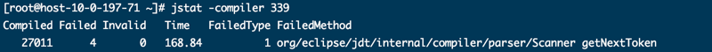
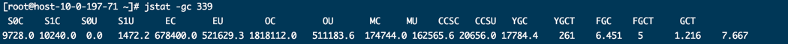
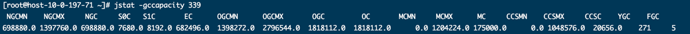
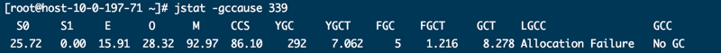
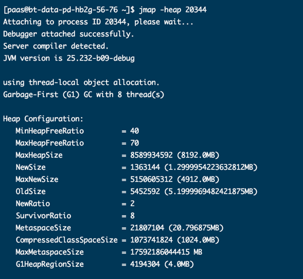
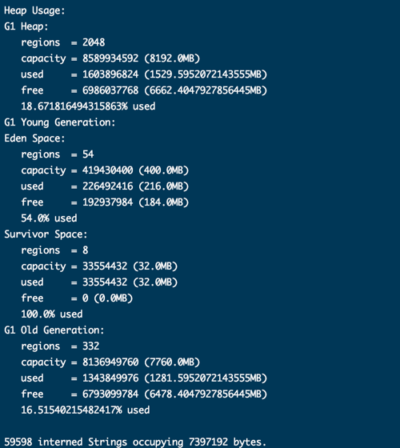
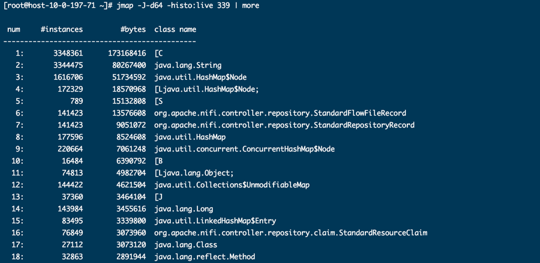
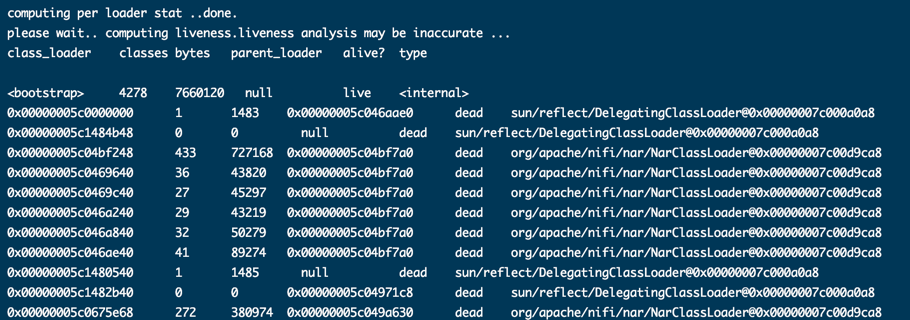
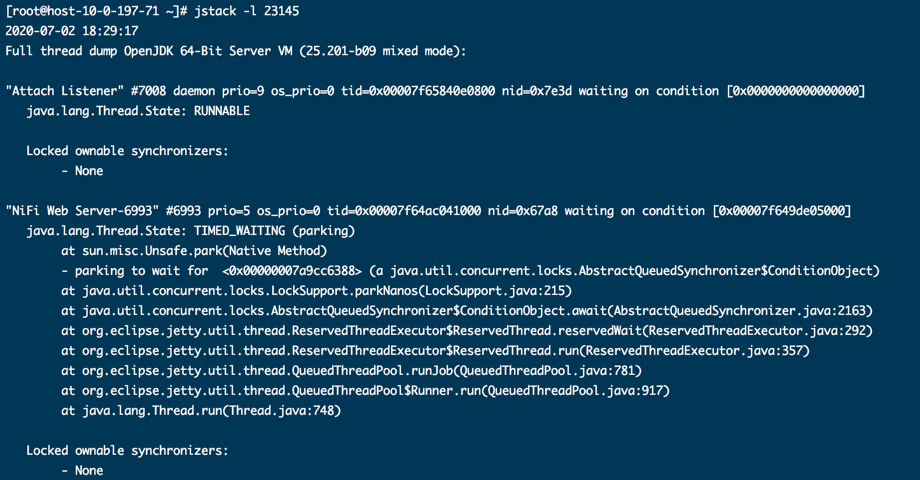

# jstat

监控 JVM 统计数据。

命令行形式如下:
```
jstat [ generalOption | outputOptions vmid [ interval[s|ms] [ count ] ]
```

## 参数说明

### generalOption

没啥说的，参阅 [文档](https://docs.oracle.com/javase/8/docs/technotes/tools/unix/jstat.html#BEHHGFAE) 。

### OutputOptions

#### -statOption
用于指定 jstat 命令输出的具体统计信息，详细的参数如下：
##### class

类加载相关的指标。输出如下所示：


- Loaded: 已加载的 class 数目
- Bytes: 已加载的 class 大小，单位kB
- Unloaded: 已卸载的 class 数目
- Bytes: 已卸载的 class 大小，单位kB
- Time: class 加载卸载花费的时间，单位s

##### compiler
JVM jit 编译相关的统计。输出格式如下所示:


- Compiled: 已执行的编译任务数
- Failed: 执行失败的编译任务数
- Invalid: 无效的编译任务数
- Time: 即时编译花费的时间，单位s
- FailedType: 上次编译失败的编译类型
- FailedMethod: 上次编译失败的类和方法

##### gc
堆 GC 相关的统计。输出格式如下：

- S0C: 当前 s0 容量，单位kB
- S1C: 当前 s1 容量，单位kB
- S0U: s0 使用量，单位kB
- S1U: s1 使用量，单位kB
- EC: 当前 eden 区容量，单位kB
- EU: Eden 区使用量，单位kB
- OC: 老年代容量，单位kB
- OU: 老年代使用量，单位kB
- MC: Metaspace 容量，单位kB
- MU: Metaspace 使用量，单位kB
- CCSC: Compressed class space 容量，单位kB
- CCSU: Compressed class space 使用量，单位kB
- YGC: 年轻代 GC 事件数
- YGCT: 年轻代 GC 花费总时间，单位 s
- FGC: full GC 事件数
- FGCT: full GC 花费总时间，单位 s
- GCT: GC 总时间，单位 s

##### gccapacity
内存分代容量。输出格式如下：

- NGCMN: 新生代最小容量，单位 kB
- NGCMX: 新生代最大容量，单位 kB
- NGC: 新生代当前容量，单位 kB
- S0C: s0 当前容量，单位 kB
- S1C: s1 当前容量，单位 kB
- EC: Eden 区当前容量，单位 kB
- OGCMN: 老年代最小容量，单位 kB
- OGCMX: 老年代最大容量，单位 kB
- OGC: 老年代当前容量，单位 kB
- OC: 老年代当前容量，单位 kB
- MCMN: Metaspace 最小容量，单位 kB
- MCMX: Metaspace 最大容量，单位 kB
- MC: Metaspace 当前容量，单位 kB
- CCSMN: Compressed class space 当前容量，单位 kB
- CCSMX: Compressed class space 当前容量，单位 kB
- CCSC: Compressed class space 当前容量，单位 kB
- YGC: 年轻代 GC 事件数
- FGC: Full GC 事件数

    OGC = sum(OC)

##### gcutil
GC 统计概要。输出格式如下所示：

- S0: s0 当前使用量与 s0 当前容量的百分比
- S1: s1 当前使用量与 s1 当前容量的百分比
- E: Eden 区当前使用量与 eden 区当前容量的百分比
- O: Old 区当前使用量与 old 区当前容量的百分比
- M: Metaspace 当前使用量与 metaspace 当前容量的百分比
- CCS: Compressed class space 当前使用量与 Compressed class space 当前容量的百分比
- YGC: 年轻代 GC 事件数
- YGCT: 年轻代 GC 花费时间，单位 s
- FGC: Full GC 事件数
- FGCT: Full GC 花费时间，单位 s
- GCT: GC 花费时间，单位 s
##### gccause
显示上次 GC 事件和当前 GC 事件的详细信息。输出格式如下：

- LGCC: 上次 GC 原因
- GCC: 本次 GC 原因
- 其他参数与 gcutil 输出一样


##### 其他参数请参考 [官方文档](https://docs.oracle.com/javase/8/docs/technotes/tools/unix/jstat.html#BEHHGFAE)
- gcnew
- gcnewcapacity
- gcold
- gcoldcapacity
- gcmetacapacity
- printcompilation

#### -h n
每 n 次采样显示一次列头部信息，默认值为0，表示仅在第一行显示。
#### -t
显示 timestamp 作为第一列，表示 JVM 启动到现在的秒数。

# jmap
打印 java 进程、dump 文件中共享对象内存映射以及堆内存的细节信息。
如果是64位的 JVM，可能还需要加上参数 -J-d64.

命令行形式如下：
```
jmap [ options ] pid

jmap [ options ] executable core

jmap [ options ] [ pid ] server-id@ ] remote-hostname-or-IP
```
## -dump:[live,] format=b, file=filename

以 hprof 二进制格式生成堆转储文件到 filename 文件中。其中，live 是
可省略的。如果不省略，表示转储堆中存活的对象。

## -finalizerinfo

打印等待终结的对象信息。

## -heap
打印 GC 使用的堆概要，堆的配置和使用情况，以及 interned string 的个数和大小。输出  
格式如下所示:





## -histo[:live]
打印堆内存占用直方图。对于每一个 java 类，打印出对象个数、占用的内存字节数、类的全限定名等。
JVM 内部类以 * 开始。如果指定 live，表示打印存活对象。输出格式如下所示：



## -clstats
打印类加载器的统计信息。输出格式如下所示：



- class_loader：类加载器地址
- classes：类加载器加载类的个数
- bytes：类加载器加载的类占用 metadata 的大小
- parent_loader：父加载器地址
- alive？：加载器对象是否将被 GC 回收
- type：类加载器类名称

## -F
强制。当执行 jmap -dump 或者 jmap -histo 时，JVM 没有响应可使用该选项。

# jhat

分析堆转储文件。命令行格式如下：

`jhat [ options ] <heap-dump-file>`

没啥说的，看一参考 [官方文档](https://docs.oracle.com/javase/7/docs/technotes/tools/share/jhat.html) 。

# jstack

打印指定Java进程的线程的Java堆栈跟踪信息，包括类全路径名称、方法名称、行号等。命令行格式如下：

`jstack [options] pid`

## -l 打印锁的相关信息
