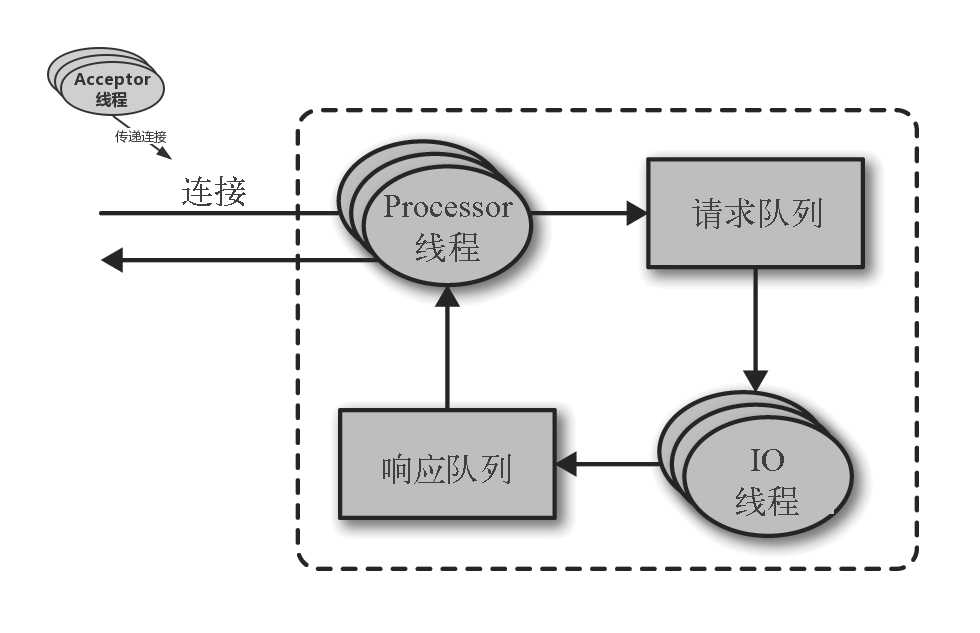
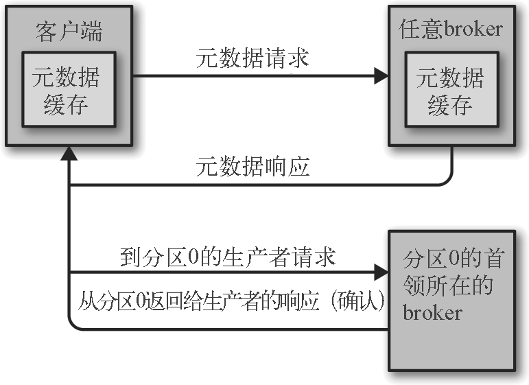

=== 处理请求

请求来源：*客户端、分区副本和控制器*。

请求的目的地：*分区首领*。

请求协议：二进制协议，基于TCP，制定了请求消息的格式以及broker如何对请求做出响应。

broker 按照消息到达的顺序处理，保证 kafka 具有消息队列的特性，保证保存的消息是有序的。

==== 标准的消息头：

* Request type: API key

* Request version: 发送请求的客户端版本

* Correlation ID: 唯一性的数据，标识请求消息

* Client ID: 标识发送请求的客户端

==== 请求流程

broker在监听的每一个端口上运行一个Acceptor线程，此线程创建连接并交给Processor线程（又叫“网络线程”）处理。
Processor线程数量是可配置的。网络线程从客户端获取请求消息，放入*请求队列*，然后从*响应队列*获取响应消息，把他们发送给客户端。
请求消息放入请求队列后，IO线程负责处理它们。

==== 请求类型

生产请求：生产者发送的请求

获取请求：消费者和跟随者副本发送的请求

元数据请求：用于获取主题的分区及副本，以及首领副本的请求

NOTE: metadata.max.age.ms用于配置元数据刷新时间间隔。

客户端可以设置broker返回数据的上限和下限，还可以设置超时时间，如果无法在 X 毫秒内累积满足要求的数据量，那么就把当前这些数据返回。

并不是所有保存在分区首领上的数据都可以被客户端读取，大部分客户端只能读取已经被写入所有同步副本的消息（跟随者副本也不行，尽管它们也是消费者——否则复制功能就无法工作）。

=== 物理存储

Kafka 的基本存储单元是分区。分区无法在多个 broker 间进行再细分，也无法在同一个 broker 的多个磁盘上进行再细分。
在配置 Kafka 的时候，管理员指定了一个用于存储分区的目录清单——也就是 log.dirs 参数的值。

==== 分区分配

* 在 broker 间平均地分布分区副本。

* 确保每个分区的每个副本分布在不同的 broker 上。

* 如果为 broker 指定了机架信息，那么尽可能把每个分区的副本分配到不同机架的 broker 上。

然后，单独为每个分区分配目录，规则很简单：计算每个目录里的分区数量，新的分区总是被添加到数量最小的那个目录里。

NOTE: 在为 broker 分配分区时并没有考虑可用空间和工作负载问题，但在将分区分配到磁盘上时会考虑分区数量，不过不考虑分区大小。
如果有些 broker 的磁盘空间比其他 broker 要大（有可能是因为集群同时使用了旧服务器和新服务器），有些分区异常大，或者同一个 broker 上有大小不同的磁盘，那么在分配分区时要格外小心。

==== 文件管理

因为在一个大文件里查找和删除消息是很费时的，也很容易出错，所以我们把分区分成若干个片段 。默认情况下，每个片段包含 1GB 或一周的数据，以较小的那个为准。在 broker 往分区写入数据时，如果达到片段上限，就关闭当前文件，并打开一个新文件。

当前正在写入数据的片段叫作*活跃片段*。活动片段永远不会被删除，所以如果你要保留数据 1 天，但片段里包含了 5 天的数据，那么这些数据会被保留 5 天，因为在片段被关闭之前这些数据无法被删除。

broker 会为分区里的每个片段打开一个文件句柄，哪怕片段是不活跃的。这样会导致打开过多的文件句柄，所以操作系统必须根据实际情况做一些调优。

==== 索引

为了帮助 broker 更快地定位到指定的偏移量，Kafka 为每个分区维护了一个索引。索引把偏移量映射到片段文件和偏移量在文件里的位置。

Kafka 不维护索引的校验和。如果索引出现损坏，Kafka 会通过重新读取消息并录制偏移量和位置来重新生成索引。如果有必要，管理员可以删除索引，这样做是绝对安全的，Kafka 会自动重新生成这些索引。

